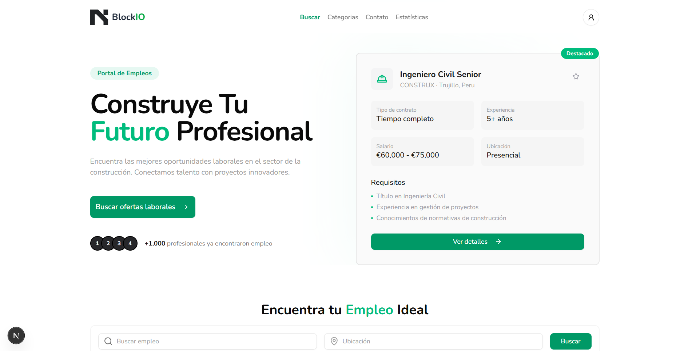
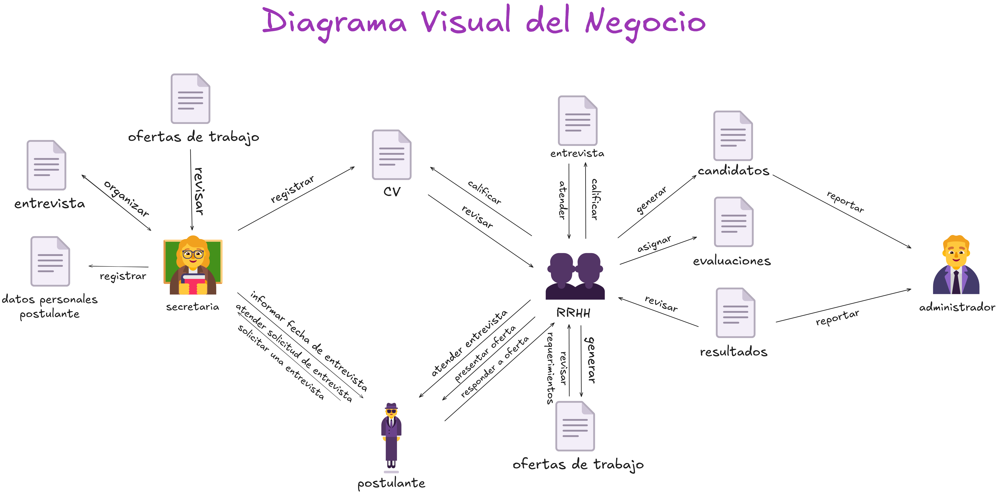
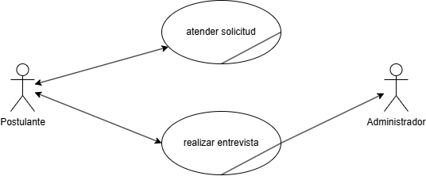
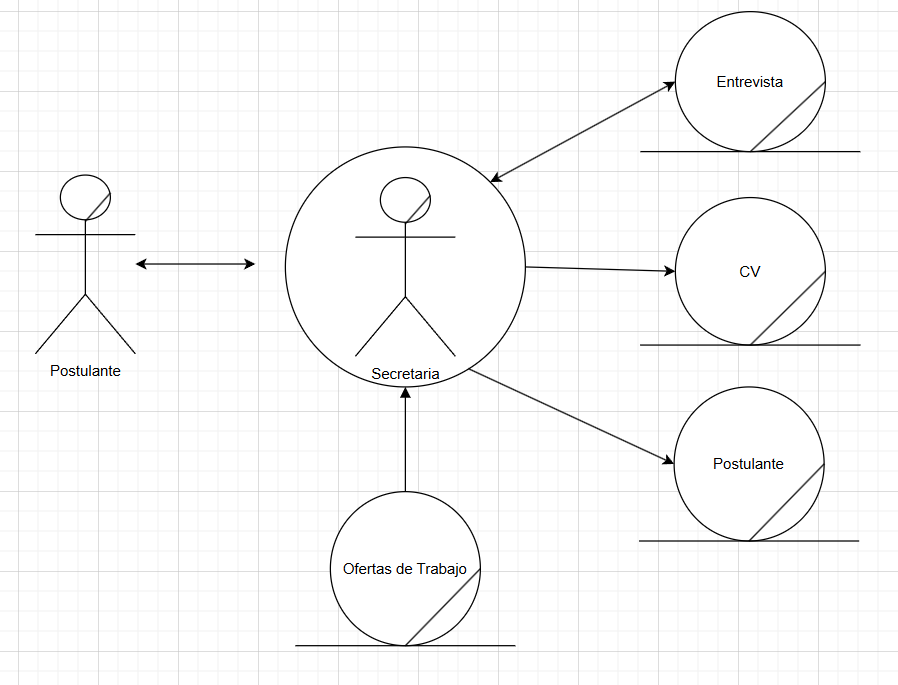
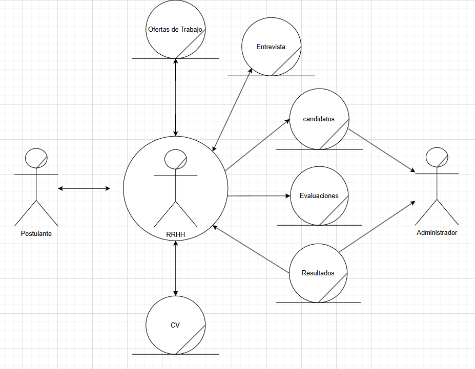
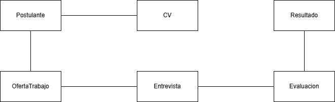
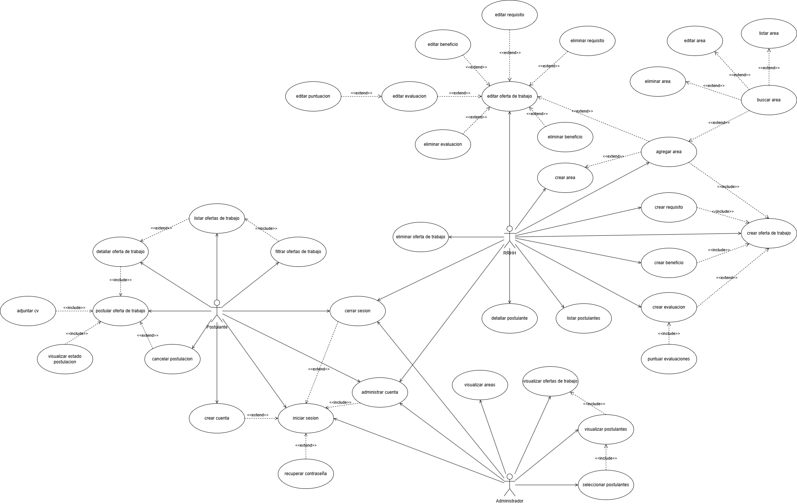

# BlockIO - Constructora

## Documentos

- [Word](https://1drv.ms/w/c/2e4310b32a46e850/ESXeNftA2i1HhBlXoaJYeUgBuQJ3xLvFAK_GeMhEW0ToxA?e=9bkN9E)
- [Drawio](https://drive.google.com/file/d/1HDMDTLyKFnb8hdhfr96ca60cYDoqE0RB/view?usp=sharing)
- [Notion](https://www.notion.so/Sistema-de-Contrataci-n-de-Personal-Constructora-1d83d565278b8041978afb6dc7146a31?source=copy_link)
- [Figma](https://www.figma.com/design/3clktrPCjFf0RpuyxtQJTC/Blockito---Constructora?node-id=1-7&t=skwruTowEQpgUTJY-1)
  password: holly-split-memory-snuff

## Requisitos

### Funcionales

#### Usuario

- [ ] RF01: Yo como usuario requiero registrarme con nombre de usuario, correo
      electrónico y contraseña para crear mi perfil de usuario.
- [ ] RF02: Yo como usuario requiero iniciar sesión con correo electrónico y
      contraseña para poder postularme a ofertas laborales
- [ ] RF03: Yo como usuario requiero recuperar mi contraseña con un código de
      autenticación para poder acceder a mi cuenta
- [ ] RF04: Yo como usuario requiero administrar mi cuenta para poder actualizar
      mi información personal

#### Postulante

- [ ] RF01: Yo como postulante requiero ver la lista de ofertas laborales
      activas con título del puesto, área, tipo de trabajo, ubicación, salario y
      fecha de vencimiento para poder informarme sobre las oportunidades
      laborales
- [ ] RF02: Yo como postulante requiero filtrar las ofertas laborales por área,
      tipo de trabajo, ubicación y salario para poder encontrar ofertas que se
      ajusten a mis necesidades
- [ ] RF03: Yo como postulante requiero ver los detalles de una oferta laboral
      con titulo del puesto, área, tipo de trabajo, ubicación, salario,
      candidatos requeridos, fecha de vencimiento, descripción del puesto,
      requisitos del puesto, beneficios y evaluaciones para poder evaluar si me
      interesa postularme
- [ ] RF04: Yo como postulante requiero postularme a una oferta laboral con mi
      CV para que se pueda evaluar mi candidatura
- [ ] RF05: Yo como postulante requiero adjuntar mi cv en formato PDF para que
      se pueda evaluar mi candidatura
- [ ] RF06: Yo como postulante requiero ver el estado de mi postulación en todo
      el proceso de selección para saber si fui seleccionado, rechazado o si mi
      postulación está en evaluación

#### RRHH:

- [ ] RF01: Yo como RRHH requiero crear las áreas que existen en la empresa con
      el nombre del área para asociarlas a las ofertas laborales
- [ ] RF02: Yo como RRHH requiero listar las áreas creadas con el nombre del
      área, fecha de creación y fecha de actualización para poder ver las áreas
      existentes
- [ ] RF03: Yo como RRHH requiero editar las áreas existentes para actualizar la
      información de las áreas
- [ ] RF04: Yo como RRHH requiero eliminar las áreas existentes para poder
      mantener la base de datos actualizada
- [ ] RF05: Yo como RRHH requiero buscar las áreas existentes por nombre para
      poder encontrar rápidamente el área que necesito
- [ ] RF06: Yo como RRHH requiero crear ofertas laborales con título del puesto,
      área, tipo de trabajo, ubicación, salario, candidatos requeridos, fecha de
      vencimiento, descripción del puesto, requisitos del puesto, beneficios y
      evaluaciones para poder publicar ofertas laborales
- [ ] RF07: Yo como RRHH requiero listar las ofertas laborales con título del
      puesto, área, tipo de trabajo, ubicación, estado, candidatos requeridos,
      fecha de vencimiento
- [ ] RF08: Yo como RRHH requiero editar las ofertas laborales para actualizar
      la información de las ofertas
- [ ] RF09: Yo como RRHH requiero eliminar las ofertas laborales
- [ ] RF10: Yo como RRHH requiero crear los requisitos asociados a la oferta
      laboral con nombre del requisito para poder evaluar el cv de los
      postulantes
- [ ] RF11: Yo como RRHH requiero crear los beneficios asociados a la oferta
      laboral con nombre del beneficio para poder informar a los postulantes
- [ ] RF12: Yo como RRHH requiero crear las evaluaciones asociadas a la oferta
      laboral con tipo de evaluación, peso de la evaluación y descripción de la
      evaluación para poder evaluar a los postulantes
- [ ] RF13: Yo como RRHH requiero listar los postulantes que se han postulado a
      una oferta laboral con nombre, apellido, correo electrónico, teléfono y
      estado de la postulación para poder evaluar a los postulantes
- [ ] RF14: Yo como RRHH requiero ver el detalle de un postulante con nombre,
      apellido, correo electrónico, teléfono, cv, estado de la postulación,
      evaluaciones y fecha de postulación para poder evaluar al postulante
- [ ] RF15: Yo como RRHH requiero puntuar el resultado de la entrevista
      realizada a los postulantes
- [ ] RF16: Yo como RRHH requiero puntuar los resultados de las evaluaciones de
      cada oferta laboral dada por los postulantes

#### Administrador:

- [ ] RF01: Yo como administrador requiero ver las áreas de la empresa con un
      gráfico para poder ver la cantidad de ofertas laborales por área
- [ ] RF02: Yo como administrador requiero ver las ofertas laborales con un
      gráfico para poder ver la cantidad de postulantes por oferta laboral
- [ ] RF03: Yo como administrador requiero ver los postulantes con un gráfico
      para poder ver la cantidad de postulantes por área
- [ ] RF04: Yo como administrador requiero ver los postulantes con un gráfico
      para poder ver la cantidad de postulantes por oferta laboral
- [ ] RF05: Yo como administrador requiero seleccionar a los postulantes con
      mejor puntuación final para ser contratados

### No Funcionales

#### Rendimiento y Seguridad

- [ ] RNF01: Yo como sistema requiero procesar solicitudes de contratación con
      capacidad para 50 usuarios concurrentes para mantener un rendimiento
      óptimo sin degradación.
- [ ] RNF02: Yo como sistema requiero implementar mecanismos de autenticación
      con métodos seguros de verificación de identidad para proteger los datos
      sensibles de usuarios y empresa.
- [ ] RNF03: Yo como sistema requiero funcionar correctamente con compatibilidad
      en todos los navegadores web activos para permitir el acceso global a los
      usuarios.
- [ ] RNF04: Yo como sistema requiero realizar copias de seguridad con procesos
      automáticos nocturnos de frecuencia diaria para garantizar la integridad y
      evitar pérdidas de datos.

#### Usabilidad

- [ ] RNF01: Yo como sistema requiero exportar reportes generados con conversión
      a formato PDF para facilitar la distribución y lectura de información.

#### Infraestructura

- [ ] RNF01: Yo como sistema requiero gestionar datos con una base de datos
      PostgreSQL de 5GB de almacenamiento, capacidad de 100 millones de lecturas
      y 10 millones de escrituras mensuales para soportar el volumen de
      operaciones requerido.

## Diagramas

### Visual

### Casos de Uso

### Objetos del Negocio

### Dominio

### Casos de Uso de Requerimientos

