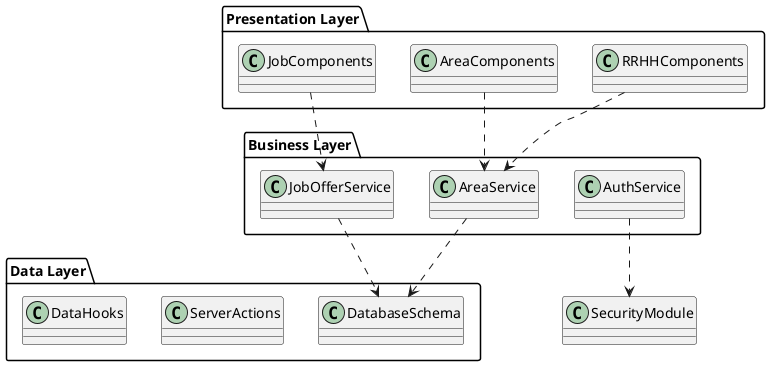

# Diagrama de Componentes - BlockIO (Metodología RUP)

_Basado en el Diagrama de Clases del Sistema_

## Estructura del Sistema

### Capa de Presentación (UI Layer)

```
┌─────────────────────────┐  ┌─────────────────────────┐  ┌─────────────────────────┐
│         📦              │  │         📦              │  │         📦              │
│   AdministracionUI      │  │   PostulacionUI         │  │      OfertaUI           │
├─────────────────────────┤  ├─────────────────────────┤  ├─────────────────────────┤
│ Interfaces:             │  │ Interfaces:             │  │ Interfaces:             │
│ ○─ IAdminView           │  │ ○─ IPostulanteView      │  │ ○─ IOfertaView          │
│ ○─ IUserManagement      │  │ ○─ IAplicacionView      │  │ ○─ IOfertaForm          │
├─────────────────────────┤  ├─────────────────────────┤  ├─────────────────────────┤
│ Sub-components:         │  │ Sub-components:         │  │ Sub-components:         │
│ • AdminDashboard        │  │ • PostulanteProfile     │  │ • OfertaView            │
│ • UserManagement        │  │ • AplicacionForm        │  │ • OfertaForm            │
│ • RoleManagement        │  │ • CVUpload              │  │ • OfertaTable           │
│ • Reports               │  │ • EstadoPostulacion     │  │ • RequisitosView        │
└─────────────────────────┘  └─────────────────────────┘  └─────────────────────────┘
            │                            │                            │
            ┅┅┅┅┅┅┅┅┅┅┅┅┅┅┅┅┅┅┅┅┅┅┅┅┅┅┅┅┅┅┅┅┅┅┅┅┅┅┅┅┅┅┅┅┅┅┅┅┅┅┅┅┅┅┅┅┅┅┅┅┅┅┅┅┅
            ▼                            ▼                            ▼

┌─────────────────────────┐  ┌─────────────────────────┐  ┌─────────────────────────┐
│         📦              │  │         📦              │  │         📦              │
│      EvaluacionUI       │  │        RrhhUI           │  │       AuthUI            │
├─────────────────────────┤  ├─────────────────────────┤  ├─────────────────────────┤
│ Interfaces:             │  │ Interfaces:             │  │ Interfaces:             │
│ ○─ IEvaluacionView      │  │ ○─ IRrhhDashboard       │  │ ○─ ILoginForm           │
│ ○─ IPuntajeForm         │  │ ○─ ICriteriosView       │  │ ○─ IRegisterForm        │
├─────────────────────────┤  ├─────────────────────────┤  ├─────────────────────────┤
│ Sub-components:         │  │ Sub-components:         │  │ Sub-components:         │
│ • EvaluacionFisica      │  │ • OfertaManagement      │  │ • LoginForm             │
│ • EvaluacionPsicologica │  │ • EvaluacionManagement  │  │ • RegisterForm          │
│ • EvaluacionAptitud     │  │ • CriteriosPuntaje      │  │ • PasswordRecovery      │
│ • ResultadosView        │  │ • ReportsGeneration     │  │ • SessionManager        │
└─────────────────────────┘  └─────────────────────────┘  └─────────────────────────┘
            │                            │                            │
            ┅┅┅┅┅┅┅┅┅┅┅┅┅┅┅┅┅┅┅┅┅┅┅┅┅┅┅┅┅┅┅┅┅┅┅┅┅┅┅┅┅┅┅┅┅┅┅┅┅┅┅┅┅┅┅┅┅┅┅┅┅┅┅┅┅
            ▼                            ▼                            ▼
```

### Capa de Lógica de Negocio (Business Layer)

```
┌─────────────────────────┐  ┌─────────────────────────┐  ┌─────────────────────────┐
│         📦              │  │         📦              │  │         📦              │
│   AdminService          │  │   PostulacionService    │  │   OfertaLaboralService  │
├─────────────────────────┤  ├─────────────────────────┤  ├─────────────────────────┤
│ Interfaces:             │  │ Interfaces:             │  │ Interfaces:             │
│ ○─ IUserRepository      │  │ ○─ IPostulanteRepo      │  │ ○─ IOfertaRepository    │
│ ○─ IRoleManager         │  │ ○─ IAplicacionRepo      │  │ ○─ IRequisitosValidator │
├─────────────────────────┤  ├─────────────────────────┤  ├─────────────────────────┤
│ Methods:                │  │ Methods:                │  │ Methods:                │
│ • gestionarRoles()      │  │ • registrarse()         │  │ • crearOferta()         │
│ • seleccionarCandidato()│  │ • buscarOfertas()       │  │ • publicarOferta()      │
│ • generarReporte()      │  │ • postularseOferta()    │  │ • eliminarOferta()      │
│ • recuperarContraseña() │  │ • adjuntarCV()          │  │ • definirRequisitos()   │
│ • eliminarUsuario()     │  │ • verEstadoPostulacion()│  │ • esVigente()           │
│ • cambiarContraseña()   │  │ • recibirNotificacion() │  │ • definirCriteriosPuntaje()│
└─────────────────────────┘  └─────────────────────────┘  └─────────────────────────┘
            │                            │                            │
            ┅┅┅┅┅┅┅┅┅┅┅┅┅┅┅┅┅┅┅┅┅┅┅┅┅┅┅┅┅┅┅┅┅┅┅┅┅┅┅┅┅┅┅┅┅┅┅┅┅┅┅┅┅┅┅┅┅┅┅┅┅┅┅┅┅
            ▼                            ▼                            ▼

┌─────────────────────────┐  ┌─────────────────────────┐  ┌─────────────────────────┐
│         📦              │  │         📦              │  │         📦              │
│   EvaluacionService     │  │      RrhhService        │  │     AuthService         │
├─────────────────────────┤  ├─────────────────────────┤  ├─────────────────────────┤
│ Interfaces:             │  │ Interfaces:             │  │ Interfaces:             │
│ ○─ IEvaluacionRepo      │  │ ○─ IRrhhRepository      │  │ ○─ IAuthProvider        │
│ ○─ IPuntajeCalculator   │  │ ○─ ICriteriosManager    │  │ ○─ ISessionManager      │
├─────────────────────────┤  ├─────────────────────────┤  ├─────────────────────────┤
│ Methods:                │  │ Methods:                │  │ Methods:                │
│ • registrarResultado()  │  │ • crearOferta()         │  │ • registrarse()         │
│ • calcularPuntaje()     │  │ • publicarOferta()      │  │ • iniciarSesion()       │
│ • generarEvaluacion()   │  │ • eliminarOferta()      │  │ • recuperarContraseña() │
│ • evaluarFisica()       │  │ • definirRequisitos()   │  │ • cambiarContraseña()   │
│ • evaluarPsicologica()  │  │ • registrarEvaluacion() │  │ • validarSesion()       │
│ • evaluarAptitud()      │  │ • enviarNotificacion()  │  │ • cerrarSesion()        │
└─────────────────────────┘  └─────────────────────────┘  └─────────────────────────┘
            │                            │                            │
            ┅┅┅┅┅┅┅┅┅┅┅┅┅┅┅┅┅┅┅┅┅┅┅┅┅┅┅┅┅┅┅┅┅┅┅┅┅┅┅┅┅┅┅┅┅┅┅┅┅┅┅┅┅┅┅┅┅┅┅┅┅┅┅┅┅
            ▼                            ▼                            ▼
```

### Capa de Acceso a Datos (Data Access Layer)

```
┌─────────────────────────┐  ┌─────────────────────────┐  ┌─────────────────────────┐
│         📦              │  │         📦              │  │         📦              │
│   UsuarioRepository     │  │  PostulanteRepository   │  │  OfertaLaboralRepository│
├─────────────────────────┤  ├─────────────────────────┤  ├─────────────────────────┤
│ Interfaces:             │  │ Interfaces:             │  │ Interfaces:             │
│ ○─ IUsuarioEntity       │  │ ○─ IPostulanteEntity    │  │ ○─ IOfertaEntity        │
│ ○─ IAdminEntity         │  │ ○─ IAplicacionEntity    │  │ ○─ IRequisitosEntity    │
├─────────────────────────┤  ├─────────────────────────┤  ├─────────────────────────┤
│ Tables:                 │  │ Tables:                 │  │ Tables:                 │
│ • usuario               │  │ • postulante            │  │ • ofertaLaboral         │
│ • admin                 │  │ • aplicacion            │  │ • requisitos            │
│ • session               │  │ • cv                    │  │ • criteriosPuntaje      │
│ • roles                 │  │ • estadoPostulacion     │  │ • vigencia              │
└─────────────────────────┘  └─────────────────────────┘  └─────────────────────────┘
            │                            │                            │
            ┅┅┅┅┅┅┅┅┅┅┅┅┅┅┅┅┅┅┅┅┅┅┅┅┅┅┅┅┅┅┅┅┅┅┅┅┅┅┅┅┅┅┅┅┅┅┅┅┅┅┅┅┅┅┅┅┅┅┅┅┅┅┅┅┅
            ▼                            ▼                            ▼

┌─────────────────────────┐  ┌─────────────────────────┐  ┌─────────────────────────┐
│         📦              │  │         📦              │  │         📦              │
│  EvaluacionRepository   │  │     RrhhRepository      │  │  NotificacionRepository │
├─────────────────────────┤  ├─────────────────────────┤  ├─────────────────────────┤
│ Interfaces:             │  │ Interfaces:             │  │ Interfaces:             │
│ ○─ IEvaluacionEntity    │  │ ○─ IRrhhEntity          │  │ ○─ INotificacionEntity  │
│ ○─ IPuntajeEntity       │  │ ○─ ICriteriosEntity     │  │ ○─ IEmailEntity         │
├─────────────────────────┤  ├─────────────────────────┤  ├─────────────────────────┤
│ Tables:                 │  │ Tables:                 │  │ Tables:                 │
│ • evaluacion            │  │ • rrhh                  │  │ • notificaciones        │
│ • evaluacionFisica      │  │ • ofertas               │  │ • emailQueue            │
│ • evaluacionPsicologica │  │ • evaluaciones          │  │ • messageTemplates      │
│ • evaluacionAptitud     │  │ • criteriosPuntaje      │  │ • deliveryStatus        │
│ • puntajeEva            │  │ • reportes              │  │                         │
└─────────────────────────┘  └─────────────────────────┘  └─────────────────────────┘
            │                            │                            │
            ┅┅┅┅┅┅┅┅┅┅┅┅┅┅┅┅┅┅┅┅┅┅┅┅┅┅┅┅┅┅┅┅┅┅┅┅┅┅┅┅┅┅┅┅┅┅┅┅┅┅┅┅┅┅┅┅┅┅┅┅┅┅┅┅┅
            ▼                            ▼                            ▼
```

### Capa de Infraestructura (Infrastructure Layer)

```
┌─────────────────────────┐  ┌─────────────────────────┐  ┌─────────────────────────┐
│         📦              │  │         📦              │  │         📦              │
│    DatabaseConnector    │  │    FileStorageService   │  │    SecurityModule       │
├─────────────────────────┤  ├─────────────────────────┤  ├─────────────────────────┤
│ Interfaces:             │  │ Interfaces:             │  │ Interfaces:             │
│ ○─ IConnection          │  │ ○─ IFileUpload          │  │ ○─ IEncryption          │
│ ○─ ITransaction         │  │ ○─ IPDFGenerator        │  │ ○─ ITokenManager        │
├─────────────────────────┤  ├─────────────────────────┤  ├─────────────────────────┤
│ Providers:              │  │ Services:               │  │ Security:               │
│ • PostgreSQL            │  │ • CV Upload             │  │ • JWT Manager           │
│ • Connection Pool       │  │ • PDF Generation        │  │ • Password Encryption   │
│ • Migration Runner      │  │ • File Validation       │  │ • Session Control       │
│ • Backup Manager        │  │ • Document Storage      │  │ • Access Control        │
└─────────────────────────┘  └─────────────────────────┘  └─────────────────────────┘
```

## Mapeo con Estructura de Archivos y Clases del Diagrama

### Componentes UI → Estructura de Carpetas

```
📦 RRHHComponents
├── /components/rrhh/
│   ├── /area/
│   │   ├── area-view.tsx
│   │   ├── /form/
│   │   │   ├── create-form.tsx
│   │   │   └── update-form.tsx
│   │   └── /table/
│   │       └── data-table.tsx
│   ├── /header/
│   │   └── header.tsx
│   └── /navigation/
│       └── navigation.tsx

📦 JobComponents
├── /components/rrhh/jobs/
│   ├── job-offer-view.tsx
│   ├── job-form.tsx
│   ├── job-table.tsx
│   └── job-card.tsx

📦 AreaComponents
├── /components/rrhh/area/
│   ├── area-view.tsx
│   ├── /form/
│   │   ├── create-form.tsx
│   │   └── update-form.tsx
│   ├── /table/
│   │   └── data-table.tsx
│   └── /chart/
│       └── area-chart.tsx

📦 ServerActions
├── /actions/
│   ├── area.ts
│   └── job-offer.ts

📦 DatabaseSchema
├── /db/
│   ├── schema.ts
│   ├── queries.ts
│   └── index.ts

📦 DataHooks
├── /hooks/
│   └── use-chart-data.ts
```

## Dependencias Entre Componentes

### Diagrama de Dependencias

```
RRHHComponents ┅┅┅► AreaService ┅┅┅► DatabaseSchema
      │                  │               │
      │                  └─────┅┅┅► ServerActions
      │                              │
      └─────┅┅┅► AuthService ┅┅┅► SecurityModule

JobComponents ┅┅┅► JobOfferService ┅┅┅► DatabaseSchema
     │                   │                │
     │                   └─────┅┅┅► ServerActions
     │                             │
     └─────┅┅┅► ValidationService ┅┅┅► DataHooks

AreaComponents ┅┅┅► AreaService ┅┅┅► ReportingService
      │                 │               │
      │                 │               └─────┅┅┅► ExternalServices
      │                 │
      └─────┅┅┅► DataHooks ┅┅┅► DatabaseConnector
```

## Interfaces Principales

### IAreaRepository

```typescript
interface IAreaRepository {
  create(area: Area): Promise<Area>
  update(id: string, area: Partial<Area>): Promise<Area>
  delete(id: string): Promise<void>
  findById(id: string): Promise<Area | null>
  findAll(): Promise<Area[]>
}
```

### IJobOfferService

```typescript
interface IJobOfferService {
  createJobOffer(jobOffer: JobOffer): Promise<JobOffer>
  updateJobOffer(id: string, jobOffer: Partial<JobOffer>): Promise<JobOffer>
  deleteJobOffer(id: string): Promise<void>
  getJobOfferById(id: string): Promise<JobOffer | null>
  getAllJobOffers(): Promise<JobOffer[]>
  getJobOffersByArea(areaId: string): Promise<JobOffer[]>
}
```

### IAuthProvider

```typescript
interface IAuthProvider {
  authenticate(credentials: Credentials): Promise<AuthResult>
  authorize(token: string): Promise<User | null>
  validateSession(sessionId: string): Promise<boolean>
  refreshToken(refreshToken: string): Promise<string>
  logout(sessionId: string): Promise<void>
}
```

## Componentes por Estereotipo RUP

### <<boundary>> - Componentes de Interfaz

- **RRHHComponents**: Interfaz principal del módulo RRHH
- **JobComponents**: Interfaz de gestión de ofertas laborales
- **AreaComponents**: Interfaz de gestión de áreas

### <<control>> - Componentes de Control

- **AreaService**: Lógica de negocio para áreas
- **JobOfferService**: Lógica de negocio para ofertas laborales
- **AuthService**: Lógica de autenticación y autorización
- **ReportingService**: Lógica de generación de reportes
- **NotificationService**: Lógica de notificaciones
- **ValidationService**: Lógica de validación

### <<entity>> - Componentes de Entidad

- **DatabaseSchema**: Definición de esquemas de datos
- **ServerActions**: Acciones del servidor para manipulación de datos
- **DataHooks**: Hooks para acceso a datos
- **DatabaseConnector**: Conector a la base de datos
- **SecurityModule**: Módulo de seguridad

## Patrones de Diseño Implementados

### Repository Pattern

- **AreaRepository**: Acceso a datos de áreas
- **JobOfferRepository**: Acceso a datos de ofertas laborales
- **UserRepository**: Acceso a datos de usuarios

### Service Layer Pattern

- **AreaService**: Servicios de negocio para áreas
- **JobOfferService**: Servicios de negocio para ofertas laborales
- **AuthService**: Servicios de autenticación

### Observer Pattern

- **NotificationService**: Para notificaciones en tiempo real
- **DataHooks**: Para actualización reactiva de datos

## Leyenda de Notación UML

| Símbolo     | Significado                 |
| ----------- | --------------------------- |
| `📦`        | Componente UML              |
| `○─`        | Interfaz proporcionada      |
| `─○`        | Interfaz requerida          |
| `────────►` | Dependencia "uses"          |
| `┅┅┅┅┅┅┅►`  | Dependencia "depends"       |
| `────────▷` | Implementación "implements" |

## Configuración para Herramientas de Diagramado

### Para Miro

- **Paleta de Colores**:
  - 🔵 Azul (#2563EB): Capa de Presentación
  - 🟢 Verde (#059669): Capa de Lógica de Negocio
  - 🟠 Naranja (#EA580C): Capa de Datos
  - 🟣 Morado (#9333EA): Capa de Infraestructura

### Dimensiones Sugeridas

- **Componente principal**: 300px × 200px
- **Espaciado entre capas**: 100px
- **Ancho total del diagrama**: 1400px
- **Alto total del diagrama**: 1000px

### Para PlantUML


