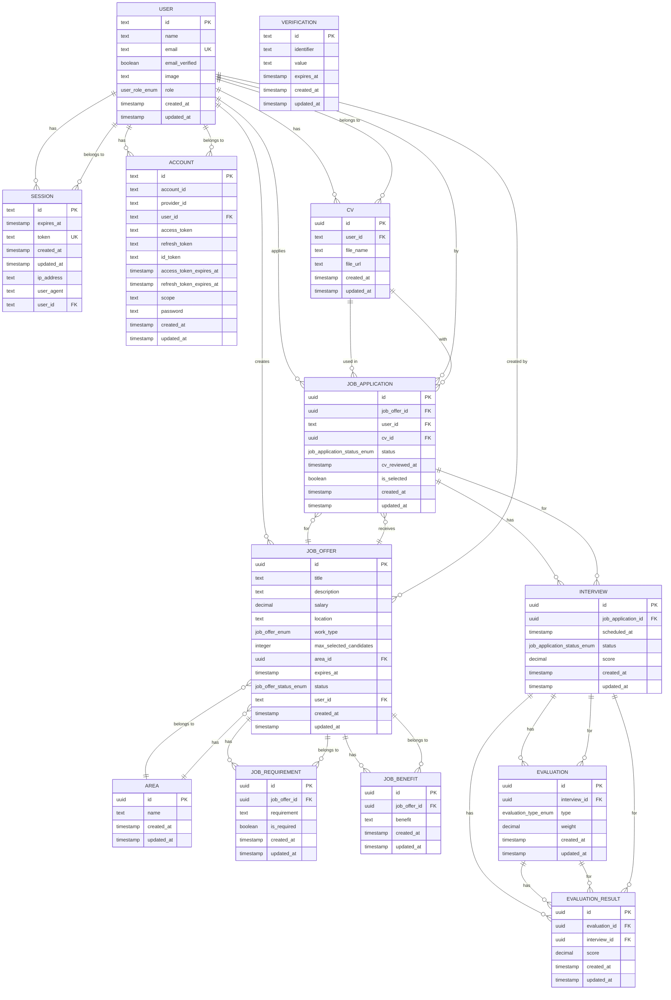

# Entity-Relationship Diagram

## Entities and Relationships

```mermaid
erDiagram
    USER {
        text id PK
        text name
        text email UK
        boolean email_verified
        text image
        user_role_enum role
        timestamp created_at
        timestamp updated_at
    }

    SESSION {
        text id PK
        timestamp expires_at
        text token UK
        timestamp created_at
        timestamp updated_at
        text ip_address
        text user_agent
        text user_id FK
    }

    ACCOUNT {
        text id PK
        text account_id
        text provider_id
        text user_id FK
        text access_token
        text refresh_token
        text id_token
        timestamp access_token_expires_at
        timestamp refresh_token_expires_at
        text scope
        text password
        timestamp created_at
        timestamp updated_at
    }

    VERIFICATION {
        text id PK
        text identifier
        text value
        timestamp expires_at
        timestamp created_at
        timestamp updated_at
    }

    CV {
        uuid id PK
        text user_id FK
        text file_name
        text file_url
        timestamp created_at
        timestamp updated_at
    }

    AREA {
        uuid id PK
        text name
        timestamp created_at
        timestamp updated_at
    }

    JOB_OFFER {
        uuid id PK
        text title
        text description
        decimal salary
        text location
        job_offer_enum work_type
        integer max_selected_candidates
        uuid area_id FK
        timestamp expires_at
        job_offer_status_enum status
        text user_id FK
        timestamp created_at
        timestamp updated_at
    }

    JOB_REQUIREMENT {
        uuid id PK
        uuid job_offer_id FK
        text requirement
        boolean is_required
        timestamp created_at
        timestamp updated_at
    }

    JOB_BENEFIT {
        uuid id PK
        uuid job_offer_id FK
        text benefit
        timestamp created_at
        timestamp updated_at
    }

    JOB_APPLICATION {
        uuid id PK
        uuid job_offer_id FK
        text user_id FK
        uuid cv_id FK
        job_application_status_enum status
        timestamp cv_reviewed_at
        boolean is_selected
        timestamp created_at
        timestamp updated_at
    }

    INTERVIEW {
        uuid id PK
        uuid job_application_id FK
        timestamp scheduled_at
        job_application_status_enum status
        decimal score
        timestamp created_at
        timestamp updated_at
    }

    EVALUATION {
        uuid id PK
        uuid interview_id FK
        evaluation_type_enum type
        decimal weight
        timestamp created_at
        timestamp updated_at
    }

    EVALUATION_RESULT {
        uuid id PK
        uuid evaluation_id FK
        uuid interview_id FK
        decimal score
        timestamp created_at
        timestamp updated_at
    }

    USER ||--o{ SESSION : "has"
    USER ||--o{ ACCOUNT : "has"
    USER ||--o{ CV : "has"
    USER ||--o{ JOB_APPLICATION : "applies"
    USER ||--o{ JOB_OFFER : "creates"
    SESSION }o--|| USER : "belongs to"
    ACCOUNT }o--|| USER : "belongs to"
    CV }o--|| USER : "belongs to"
    CV ||--o{ JOB_APPLICATION : "used in"
    AREA ||--o{ JOB_OFFER : "has"
    JOB_OFFER }o--|| AREA : "belongs to"
    JOB_OFFER ||--o{ JOB_REQUIREMENT : "has"
    JOB_OFFER ||--o{ JOB_BENEFIT : "has"
    JOB_OFFER ||--o{ JOB_APPLICATION : "receives"
    JOB_OFFER }o--|| USER : "created by"
    JOB_REQUIREMENT }o--|| JOB_OFFER : "belongs to"
    JOB_BENEFIT }o--|| JOB_OFFER : "belongs to"
    JOB_APPLICATION }o--|| USER : "by"
    JOB_APPLICATION }o--|| JOB_OFFER : "for"
    JOB_APPLICATION }o--|| CV : "with"
    JOB_APPLICATION ||--o{ INTERVIEW : "has"
    INTERVIEW }o--|| JOB_APPLICATION : "for"
    INTERVIEW ||--o{ EVALUATION : "has"
    INTERVIEW ||--o{ EVALUATION_RESULT : "has"
    EVALUATION }o--|| INTERVIEW : "for"
    EVALUATION ||--o{ EVALUATION_RESULT : "has"
    EVALUATION_RESULT }o--|| EVALUATION : "for"
    EVALUATION_RESULT }o--|| INTERVIEW : "for"
```

---
