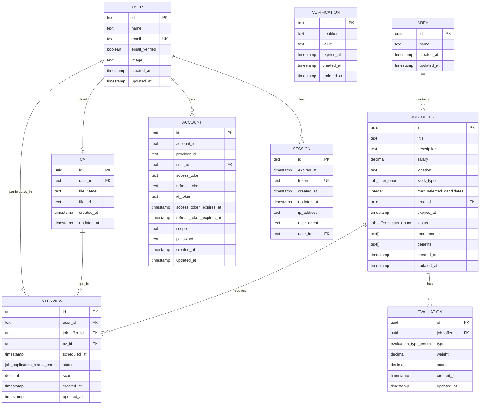
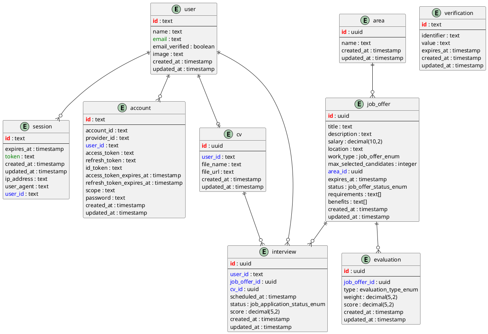

# Entity Relationship Diagram - BlockIO HR System

## Database Schema Overview

This diagram represents the database structure for the BlockIO HR management
system.

## Mermaid ER Diagram

## PlantUML ER Diagram

## Enumerations

### User Role Enum

- `admin`
- `rrhh` (Human Resources)
- `postulante` (Applicant)

### Job Offer Enum (Work Type)

- `tiempo_completo` (Full Time)
- `medio_tiempo` (Part Time)
- `contrato` (Contract)
- `practicas` (Internship)

### Job Offer Status Enum

- `activa` (Active)
- `vencida` (Expired)
- `cancelada` (Cancelled)
- `finalizada` (Finished)

### Interview/Application Status Enum

- `cv_enviado` (CV Sent)
- `cv_en_revision` (CV Under Review)
- `cv_aprobado` (CV Approved)
- `cv_rechazado` (CV Rejected)
- `entrevista_solicitada` (Interview Requested)
- `entrevista_realizada` (Interview Conducted)
- `entrevista_calificada` (Interview Scored)
- `evaluacion_en_curso` (Evaluation In Progress)
- `evaluacion_completada` (Evaluation Completed)
- `evaluacion_calificada` (Evaluation Scored)
- `seleccionado` (Selected)
- `rechazado` (Rejected)

### Evaluation Type Enum

- `fisica` (Physical)
- `psicologica` (Psychological)
- `aptitud` (Aptitude)

## Key Relationships

1. **User-CV**: One-to-One relationship (each user has one CV)
2. **User-Session**: One-to-Many (user can have multiple sessions)
3. **User-Account**: One-to-Many (user can have multiple accounts)
4. **User-Interview**: One-to-Many (user can have multiple interviews)
5. **Area-JobOffer**: One-to-Many (area contains multiple job offers)
6. **JobOffer-Evaluation**: One-to-Many (job offer can have multiple
   evaluations)
7. **JobOffer-Interview**: One-to-Many (job offer can have multiple interviews)
8. **CV-Interview**: One-to-Many (CV can be used in multiple interviews)

## Business Rules

- Each job offer belongs to exactly one area
- Each interview is associated with one user, one job offer, and one CV
- Evaluations are tied to specific job offers
- Sessions and accounts are linked to users for authentication
- The system tracks application status through the interview status enum
